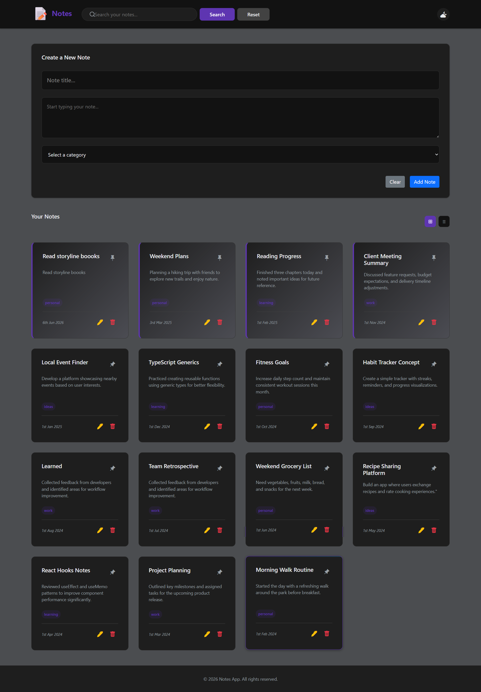
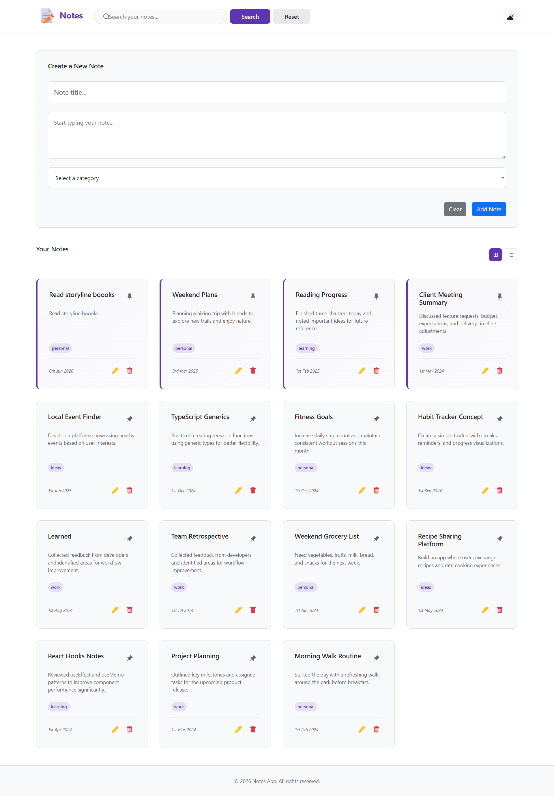

# 📝 Notes App

A modern, responsive note-taking web application built with vanilla JavaScript and localStorage for persistent data management.

## 🎯 Overview

Notes App is a lightweight, single-page application that allows users to create, manage, and organize notes with categories and pinning functionality. All data is stored locally in the browser, ensuring privacy and offline access. The app features a clean, intuitive interface with dark mode support and real-time search capabilities.

## 🖼️ Application Screenshots

<p align="center">
  
  
</p>

<p align="center">
  <em>Dark Mode</em> | <em>Light Mode</em>
</p>

## ✨ Features

* **Create & Manage Notes** – Add notes with title, content, and category
* **Pin Important Notes** – Mark notes as pinned; they appear first in the grid
* **Search Functionality** – Filter notes by title or content in real-time
* **Categorization** – Organize notes into predefined categories (Personal, Work, Learning, Ideas)
* **Dark Mode** – Toggle between light and dark themes with localStorage persistence
* **Responsive Design** – Fully responsive grid layout optimized for desktop and mobile
* **Local Storage** – All notes are saved in browser localStorage; no backend required
* **Edit & Delete** – Update note content or remove notes with confirmation dialogs
* **Timestamp Tracking** – Automatic creation and update timestamps for each note

## 🛠️ Tech Stack

* **Frontend:** HTML5, Vanilla JavaScript (ES6 Modules)
* **Styling:** CSS3 with custom design system (CSS variables)
* **UI Framework:** Bootstrap 5, Bootstrap Icons
* **Dialogs:** SweetAlert2
* **Storage:** Browser LocalStorage

## 🚀 How to Run

1. Clone the repository or download the project files
2. Open `index.html` in your web browser
3. Start creating notes immediately – no installation or setup required

## 📂 Project Structure

```
├── index.html          # Main HTML file
├── css/
│   └── style.css       # Styling and theme configuration
├── js/
│   ├── app.js          # Main application logic
│   ├── notesManager.js # CRUD operations
│   ├── ui.js           # UI rendering
│   ├── utils.js        # Utility functions
│   ├── categories.js   # Category management
└── readme.md
```

---
